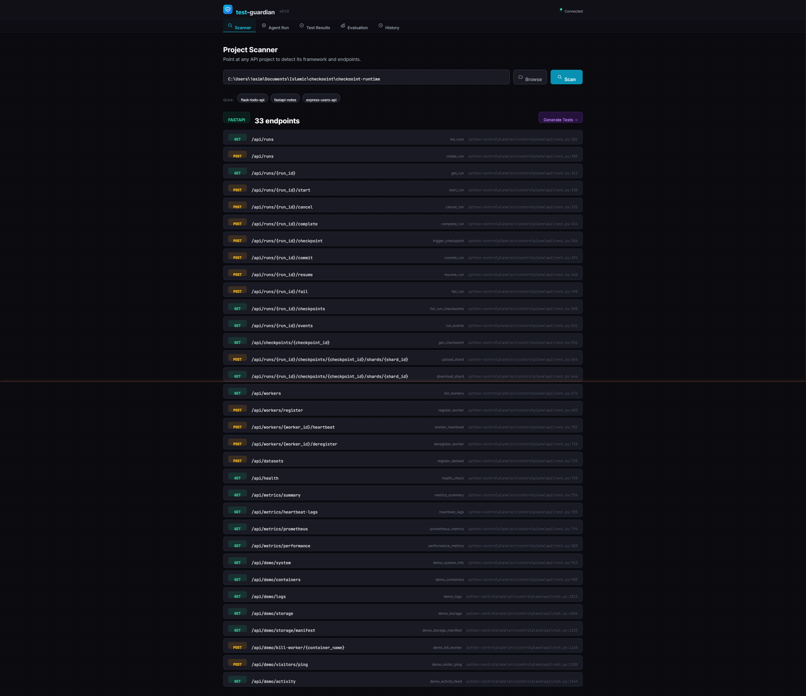
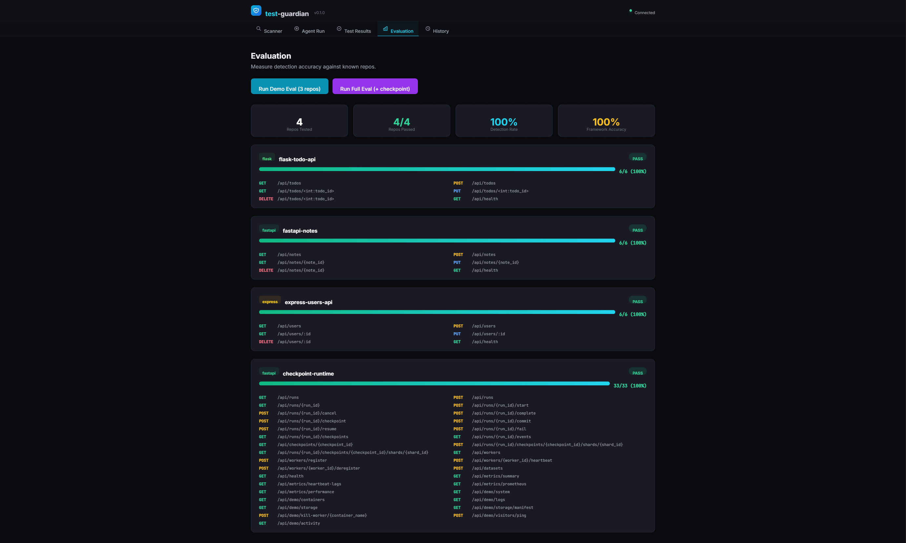

# test-guardian

An agentic CLI that joins a repo, detects API endpoints, generates test suites, runs them in a Docker sandbox, iterates to green, and produces reviewable diffs with human approval. Includes a real-time web dashboard for scanning, running, and evaluating projects.

## Dashboard

test-guardian ships with a built-in web dashboard served directly from the FastAPI backend — no separate build step required.

**Scanning checkpoint-runtime (33 FastAPI endpoints detected):**



**Evaluation — 4/4 repos at 100% detection across Flask, FastAPI, and Express:**


**Full circle — test-guardian analyzing its sibling project [checkpoint-runtime](https://ckpt.tasfiqj.com) (33/33 endpoints):**



> test-guardian was built alongside [checkpoint-runtime](https://ckpt.tasfiqj.com), a distributed training checkpoint system with a FastAPI control plane, Rust gRPC data plane, and React dashboard. Running test-guardian's scanner against checkpoint-runtime — and watching it correctly detect all 33 endpoints across runs, checkpoints, workers, metrics, and demo routes — is the full-circle moment: one project validating the other.

## Quick Start

```bash
# Install dependencies
pnpm install
pip install -e agent/

# Start the dashboard
cd agent && uvicorn guardian.server:app --reload
# Open http://localhost:8000/dashboard/

# Or use the CLI
test-guardian init ./demo/flask-todo-api
test-guardian plan
test-guardian run
```

## How It Works

```
PLAN (read-only)  →  ACT (permissioned)  →  VERIFY (sandboxed)
  Analyze repo         Generate tests          Run in Docker
  Detect endpoints     Apply diffs             Parse results
  Build plan           Checkpoint files        Fix failures
                                               Iterate (max 3x)
```

## Architecture

| Layer | Technology | Purpose |
|-------|-----------|---------|
| CLI | TypeScript + React Ink | Terminal UI, diff review, approval gates |
| Agent | Python + FastAPI | Agentic loop, LLM orchestration, tool execution |
| Dashboard | Alpine.js + Tailwind | Real-time web UI, SSE streaming, evaluation |
| Sandbox | Docker | Isolated test execution, network=none |
| Code Intel | tree-sitter | AST parsing, endpoint detection |
| LLM | Ollama (default) | Zero-cost local inference |

## Safety Model

- **Sandboxed execution** — Docker containers with `--network=none`, 120s timeout, 512MB RAM
- **Permission modes** — Plan (read-only), Default (approve each write), Trust (auto-approve)
- **Checkpoint/revert** — Every file snapshotted before modification
- **Command allowlist** — Only `pytest`, `npm test`, `vitest`, `go test`, `ruff`, `mypy`, `eslint`
- **Tool budget** — Max 50 tool calls per run

## Project Structure

```
test-guardian/
├── packages/cli/       # TypeScript + React Ink CLI
├── packages/shared/    # Shared types
├── agent/              # Python agent backend
│   └── src/guardian/
│       ├── dashboard/  # Web dashboard (routes, templates, static)
│       ├── llm/        # LLM client abstraction
│       ├── safety/     # Permission manager
│       └── tools/      # Code intel, sandbox, file ops
├── sandbox/            # Docker sandbox images
├── demo/               # Demo repos for evaluation
├── eval/               # Evaluation harness
├── CLAUDE.md           # Claude Code project guidance
├── AGENTS.md           # Agent instruction file
└── SECURITY.md         # Threat model
```

## Development

```bash
# TypeScript
pnpm test              # Run all TS tests
pnpm lint              # Lint all packages
pnpm typecheck         # Type check all packages

# Python (157 tests)
cd agent && pytest     # Run Python tests
cd agent && ruff check . && mypy src/  # Lint + typecheck

# Dashboard
cd agent && uvicorn guardian.server:app --reload
# → http://localhost:8000/dashboard/
```
